# HW 2: 3D Stylization - Shark Plane

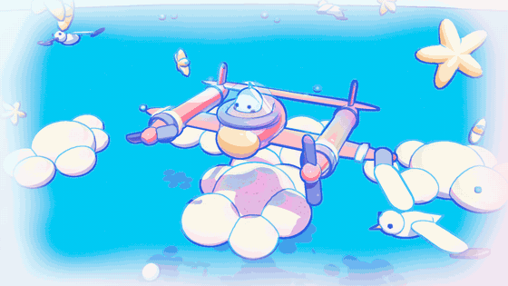

Full turnaround video (one turn in day mode, then I hit space and it does another turn at night): [Screenshots/turnaround.mp4](Screenshots/turnaround.mp4)

Scene is `Assets/Scenes/Shark Plane.unity`. Press play, then **Space** to switch between day and night. I used Unity 2022.3.25f1 (the base project was on 2022.3.9f1 and upgraded without any problems).

## Concept Art

|  | 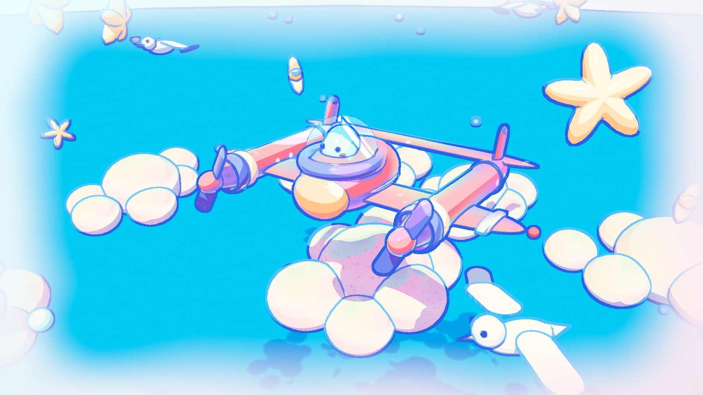 |
|:--:|:--:|
| *Concept by [requinoesis](https://www.artstation.com/requinoesis)* | *My scene in Unity* |

I picked the shark plane illustration by **requinoesis** (it's one of the examples in the writeup). A few things I really liked about it and wanted to get into 3D:
- the shadows don't just get darker, they shift hue (pink goes lavender, white goes light blue)
- the line art is colored: deep blue on the plane, light cyan on the clouds
- the soft frame around the edges that fades into the pale background
- it's mostly simple rounded shapes, which mattered since I built everything out of Unity primitives

Before making any materials I pulled the main colors straight from the image: background `#ECFEFF`, sky `#22D4FD`, plane pinks `#FC839F` / `#FE8AA5`, lavender `#B79FFB`, peach `#FDCEA0` and the line blue `#3263DC`. Every palette below starts from those.

## 0. Base project setup

**Full Screen Feature fix.** The pass blitted the camera color into the temporary buffer through the material, but never copied the result back, so nothing showed up on screen. The fix is the second blit:

```csharp
Blit(cmd, colorBuffer, temporaryBuffer, settings.material);
Blit(cmd, temporaryBuffer, colorBuffer);
```

I checked it with a fullscreen shader graph that just inverts the colors (`Shaders/Invert.shadergraph`, the fallback material the feature looks for). A few smaller changes while I was in that file:
- the temp buffer doesn't need depth or MSAA, so those are turned off in the descriptor
- I ended up with four of these features on the renderer (outlines + post, a day and a night version of each), so each one gets its own temp buffer name instead of all of them sharing `_TemporaryBuffer`
- `settings` is initialized where it's declared. Adding a new Full Screen Feature to the renderer used to throw a NullReferenceException in `Create()` because it was still null.

**Depth and normal buffers.** The depth texture was already enabled in the URP asset. For normals I added the provided `NormalFeature` to `URP-Custom-Renderer`, made `Materials/Post/Normal Copy.mat` from the `Hidden/Normal Copy` shader, and set `Buffers/Normal Buffer.renderTexture` as the target. The render texture is 1920x1080, same as my game view.

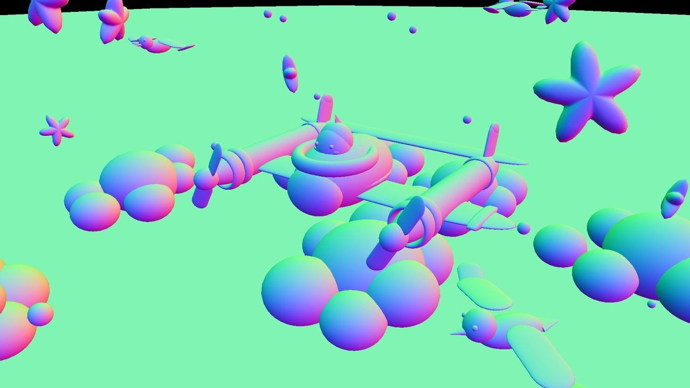

*what ends up in the normal buffer (view space normals)*

## 1. Surface shader

`Shaders/Toon Shader.shadergraph`, with the custom function code in `Shaders/Includes/LightingHelp.hlsl`. It started as my 3 tone shader from the lab. The graph is split into groups (inputs, main light, additional lights, toon ramp, specular, rim, shadow texture, combine) so it's not one giant spaghetti mess.

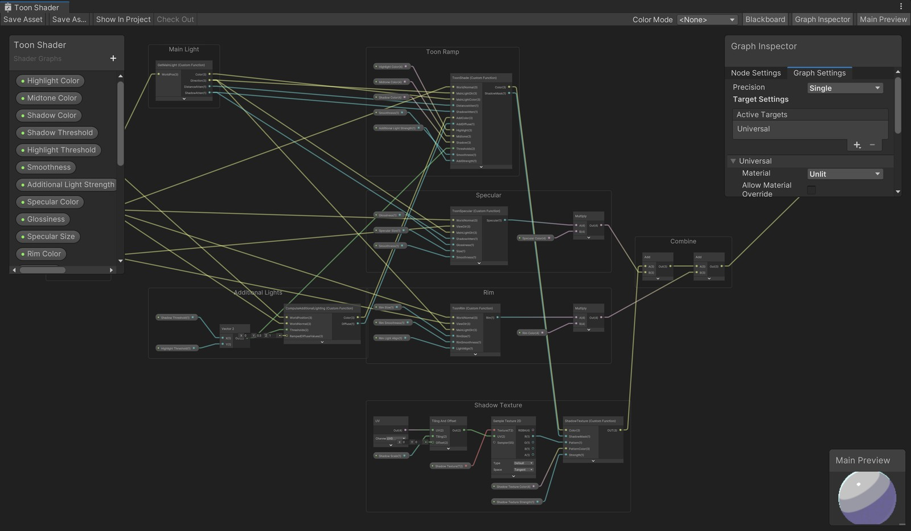

### Multiple lights
I followed the tutorial for this: `ComputeAdditionalLighting` loops over the additional lights, steps each one into the same bands as the main light (using my shadow/highlight thresholds) and tints it by the light's color. Then `ToonShade` builds the main light palette and adds the point light bands on top. I multiply them by the highlight color so they stay pastel instead of blowing out.

During the day there's a pink and a cyan point light next to the plane (the concept has pink and cyan bouncing around everywhere). At night those turn off and there's a warm cockpit light plus red/green nav lights on the wing tips.

One thing that confused me for a while: the tutorial ramp picks the band from the raw distance attenuation (1/d²) and only uses the intensity for the color, so cranking up the intensity made the bands brighter but not any bigger. The lights only really started showing up once I moved them close to the plane (they're parented to it now so they follow it around).

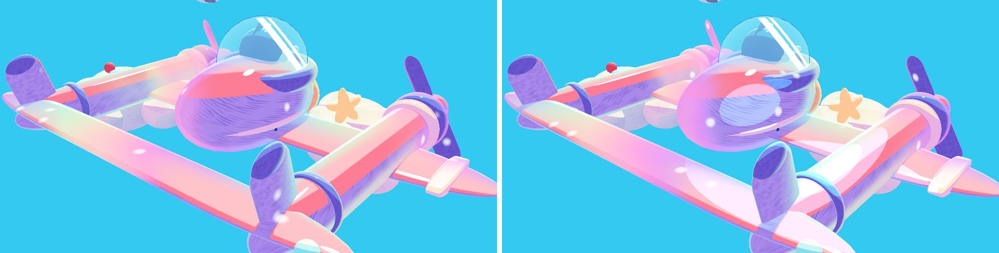
*left: sun only, right: with the cyan fill light on (seen from behind)*

### Extra lighting feature
I did both a specular and a rim:
- **Specular**: Blinn-Phong cut into one hard white blob with a smoothstep (`Glossiness`, `Specular Size`). The concept has those little white glints on everything.
- **Rim**: fresnel cut into a band. `Rim Light Align` pushes the rim towards the side facing the light, so it reads as a rim light and not just a glow all the way around. The plane gets a cyan rim like in the concept.

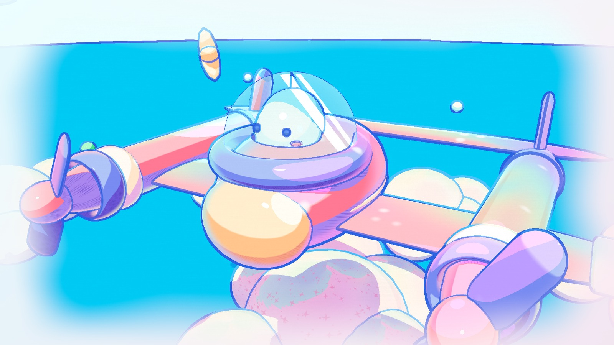

### Shadow texture
I made two tiling textures: loose hatching for the plane, and little sparkles for the clouds and stars (the concept has stars all over the place so it felt right). They're made with a small Python/PIL script, `Tools/make_textures.py`. Every stroke gets drawn again shifted by the texture size, so anything that crosses an edge wraps around and the textures tile without seams.

| Hatch | Sparkle |
|:--:|:--:|
|  |  |

Instead of screen position like in the lab, they're sampled with the mesh UVs: UV -> Tiling And Offset (tiling = `Shadow Scale`) -> Sample Texture 2D. That way the pattern sticks to the object and moves with it. Like puzzle 3, the "ink" only shows up inside the shadow band and gets mixed in with `Shadow Texture Color` / `Shadow Texture Strength`. Cast shadows count as shadow band too, so the plane's shadow on the cloud underneath gets sparkles in it.

| hatching in the plane's shadows | sparkles in the plane's shadow on the cloud |
|:--:|:--:|
| 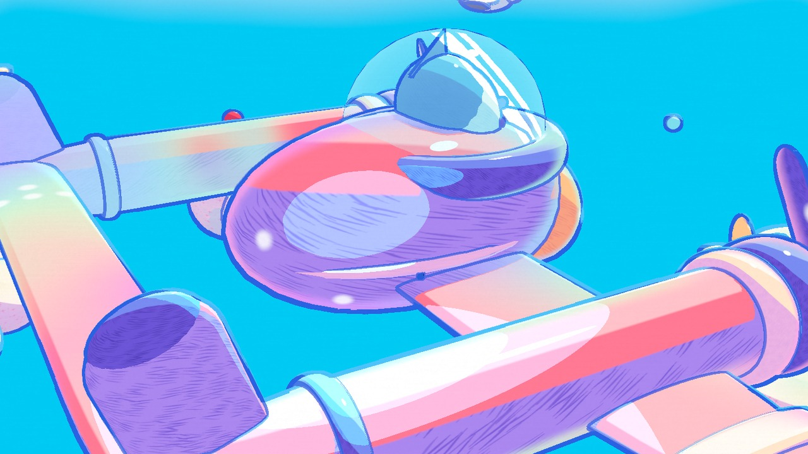 | 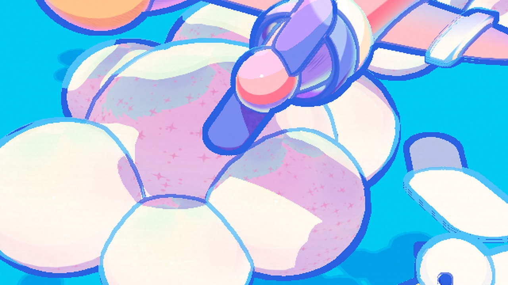 |

### Color palette
Every material has its own highlight / midtone / shadow colors picked from the concept. The main thing I tried to copy is the hue shift into the shadows:

| Material | Highlight | Midtone | Shadow |
|---|---|---|---|
| Plane body | `#FFC6D3` | `#FC7F9C` | `#A98BF5` |
| Plane accents (props, rings) | `#B2C8FF` | `#7B8EF7` | `#6C58DB` |
| Nose | `#FFF2DA` | `#FDC99A` | `#F4A58E` |
| Shark | `#FFFFFF` | `#EEFBFF` | `#A9DDF6` |
| Stars | `#FFFDF1` | `#FEEACB` | `#FDCB9C` |

## 2. Special surface shader (animated colors)

`Shaders/Toon Hero.shadergraph` is a copy of the toon graph with one more group at the end, "Holo Shimmer". The plane is the hero object so every part of it uses this. It adds a pastel rainbow band that sweeps across the whole plane like holographic foil, a rainbow rim, and sparkles that pop in and out.

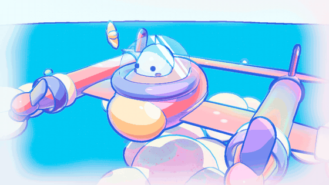

Toolbox functions in there (`HoloShimmer` in `LightingHelp.hlsl`):
- **floor / stepped time**: Time -> Multiply (Step Rate) -> Floor -> Divide, done with nodes in the graph. Everything updates at 8 fps so it feels hand animated instead of perfectly smooth.
- **sawtooth wave**: moves the band from one end of the plane to the other and then wraps around
- **gain**: shapes the falloff of the band
- **cosine palette** (iq): the pastel rainbow colors
- **value noise**: makes the edge of the band wavy
- **hash**: picks which spots sparkle, rerolled every time step

The band is computed in world space, so it moves across all the separate pieces of the plane as one thing instead of every primitive doing its own sweep.

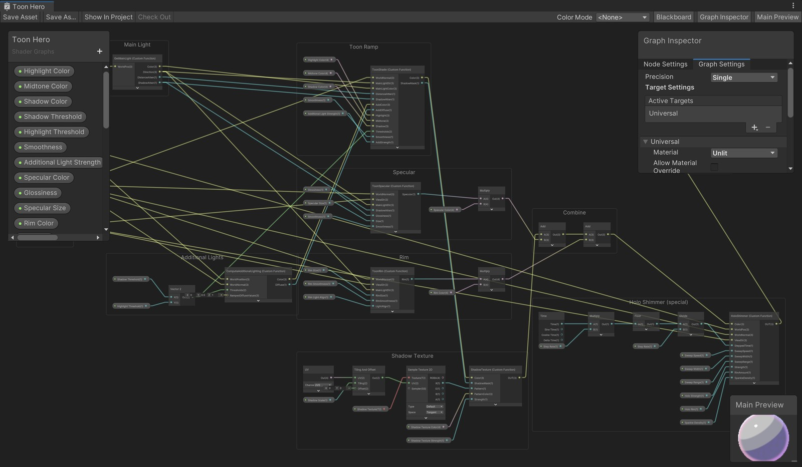
*same as the toon graph, plus the Holo Shimmer group on the bottom right*

## 3. Outlines

`Shaders/Outline.shadergraph` (fullscreen shader graph), functions in `Shaders/Includes/OutlineHelp.hlsl`. It's a Full Screen Feature that runs after transparents.

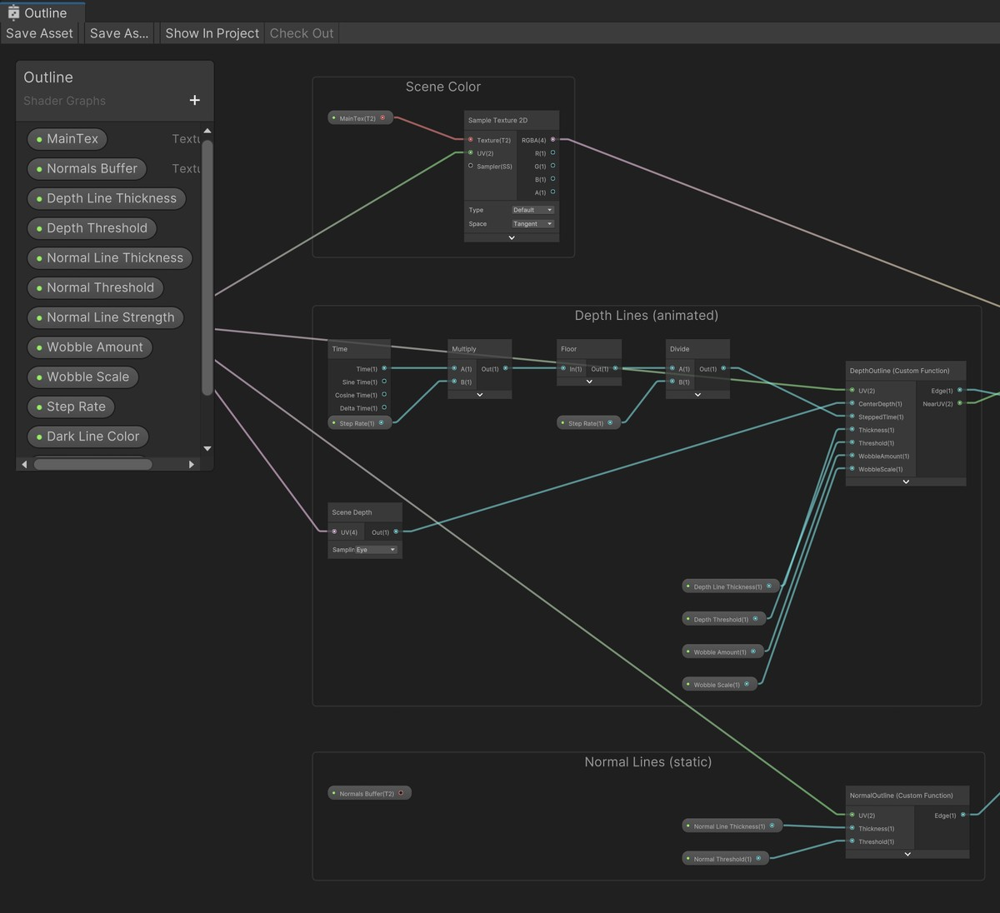

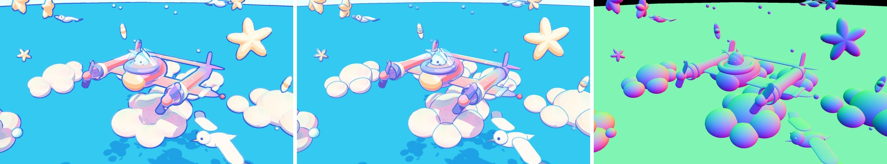
*depth lines only / normal lines only / the normal buffer*

- **Depth lines**: 3x3 Sobel on linear eye depth. I divide the gradient by the pixel's depth so one threshold works both up close and far away.
- **Normal lines**: Robert's cross on the normal buffer. These are thinner and pick up the inside edges, like the ring around the canopy, where the nose meets the body, and the wing joints.
- **Animated / hand drawn**: same idea as the example in the writeup, only the depth lines move. The sample position gets offset by noise that changes on stepped time (8 fps), so the lines "boil". The thickness also changes with noise along the line, kind of like pen pressure. The normal lines don't move so the shapes stay readable.
- **Colored lines**: the concept never uses black lines. While doing the Sobel I keep track of which tap is closest to the camera, sample the scene color there, and pick the dark blue or light cyan line based on how bright the thing in front is. So the white clouds get light lines and everything else gets the deep blue.
- Everything is adjustable on the material: depth and normal line thickness, both thresholds, wobble amount / scale / step rate, the two line colors and the brightness cutoff between them.

The glass canopy is transparent, so it's not in the depth buffer or the normal buffer and never gets a line from this pass. It draws its own outline with a fresnel cutoff instead (`Shaders/Toon Glass.shadergraph`), plus a couple of fake reflection streaks.

## 4. Full screen post process

`Shaders/Pastel Post.shadergraph` (`Includes/PostHelp.hlsl`), runs after the outlines:
- a soft rounded rectangle frame that fades the edges into pale cyan / pink, like the border around the illustration. The frame edge gets pushed around by noise so it looks painted instead of perfectly clean
- paper grain (fbm noise, plus some stretched noise for fibers). It's in pixel units so it doesn't stretch with the aspect ratio
- a small saturation boost

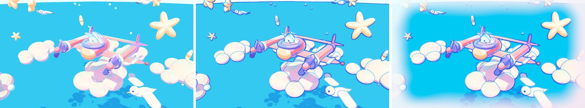
*toon shading only / + outlines / + post process*

## 5. Scene

Everything is made out of Unity primitives (spheres, capsules, cylinders) plus three meshes I generated with a little editor script, `Assets/Editor/MeshMaker.cs` (Tools > Make Meshes): a puffy 5 point star, a cone (gull beaks, shark fin) and a torus (rings on the engines and around the canopy). Nothing is downloaded.

- a twin-boom plane with a shark pilot sitting in a glass bubble
- clouds (clusters of spheres), stars, floating bubbles, three seagulls flying in circles
- the sea far below, which ends up reading like the blue panel behind the plane in the concept
- scripts: `Spin` (propellers), `Bob` (plane, clouds and stars floating), `Seagull` (wing flapping + flying in a circle), and the provided `Turntable` on the camera pivot

## 6. Interactivity: night flight

Press **Space**.

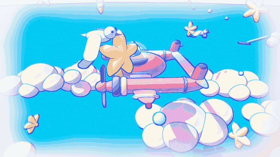

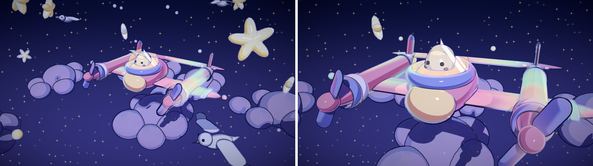

- `MaterialSwapper.cs` is pretty much the script from the writeup. It's on every part that has a night version and switches to the next material in its list. All the night materials are in `Materials/Night`.
- `SceneModeSwitcher.cs` does the rest of the scene: the sun becomes moonlight, the pink/cyan fill lights turn off and the cockpit + nav lights turn on, the sea gets hidden so there's sky all around, and it swaps which renderer features are active (day outline + pastel post vs. night outline + night post). The features live on the renderer asset, so it puts them back to day mode in `OnDisable`. Otherwise the asset stays in night mode after you stop playing.
- `Shaders/Night Post.shadergraph` is a different post effect: a gradient map towards blues and purples (anything bright keeps its own color, so the stars and the cockpit look like they glow), a night sky gradient wherever the depth is at the far plane, procedural stars that twinkle on stepped time and only show up in the empty sky, and a vignette.

Getting night mode to look good took a few tries. My first version was way too dark and muddy, mostly because the dark blue sea filled the whole background. Hiding the sea and letting bright colors skip the gradient map fixed most of it.

## 7. Extra credit: texture support with procedural colors

`Shaders/Toon Textured.shadergraph` takes a base texture instead of three picked colors and builds the three tones from it (`ProceduralPalette` in `LightingHelp.hlsl`):
- convert the texture color to HSV (in gamma space, since that's closer to how the colors were picked)
- **shadow**: the hue slides towards a `Shadow Hue` (purple here) the short way around the color wheel, saturation goes up and value goes down. Near-whites get some extra saturation so a white cloud gets a lavender shadow instead of a grey one
- **highlight**: value gets lifted towards 1, a bit less saturated, nudged slightly warm

The clouds use it with a soft pastel texture (`Textures/Cloud Pastel.png`, made by the same script), which gives them the cream / pink / mint patches that the clouds in the concept have. The night clouds use the same texture with a blue tint and a darker shadow hue. It goes through the same ramp, rim and shadow texture code as the regular toon shader, so it still gets the sparkle shadows.

## Video

[turnaround.mp4](Screenshots/turnaround.mp4), 24 seconds: one full turn in day mode, space, one full turn at night.

I recorded it with `Scripts/TurnaroundCapture.cs`. It sets `Time.captureFramerate` to 30 and saves the main camera to numbered PNGs every frame, so the video comes out smooth even when the editor can't actually render at 30 fps. It also has a `Switch Mode At Frame` option that flips to night mode halfway through (calls the same functions Space does), so the switch happens at exactly the same camera angle. Then ffmpeg:

```
ffmpeg -framerate 30 -i frame_%04d.png -c:v libx264 -pix_fmt yuv420p turnaround.mp4
```

## Things I'd fix with more time

- The normal buffer is a fixed 1920x1080 render texture, so in a differently sized game view the normal lines get a little softer.
- `Shadow Scale` is a single number, but capsule UVs stretch along the length, so the hatching gets longer on the long parts.
- The "Receive Shadows" toggle on the mesh renderer doesn't do anything for these custom lit shaders, so the sea picks up cloud shadows. I just made the sea's shadow color close to its midtone so they're subtle.

## Credits / references

- Concept art: [requinoesis](https://www.artstation.com/requinoesis)
- The tutorial videos from this assignment (full screen feature, depth and normal buffers, additional lights)
- [NedMakesGames - Sobel outlines](https://youtu.be/RMt6DcaMxcE), [Robin Seibold - Robert's cross outlines](https://youtu.be/LMqio9NsqmM), [Alexander Ameye - edge detection outlines](https://ameye.dev/notes/edge-detection-outlines/)
- [Inigo Quilez - cosine palettes](https://iquilezles.org/articles/palettes/)

---

# Original Instructions

## Project Overview:
In this assignment, you will use a 2D concept art piece as inspiration to create a 3D Stylized scene in Unity. This will give you the opportunity to explore stylized graphics techniques alongside non-photo-realistic (NPR) real-time rendering workflows in Unity.

|   |  |
|:--:|:--:|
| *2D Concept Illustration* | *3D Stylized Scene in Unity* |
### HW Task List:
1. Picking a Piece of Concept Art
2. Interesting Shaders
3. Outlines
4. Full Screen Post Process Effect
5. Creating a Scene
6. Interactivity
7. Extra Credit

---
# Tasks

## 0. Base Project Overview

After forking the repo, take a moment to watch this brief HW/Base Project Overview which goes over things that you're expected to bring over from the lab, and etc.
- [See the Project Overview here](https://youtu.be/JmVTmpgSz5U)

## 1. Picking a Piece of Concept Art

Choose a simple illustration to guide your stylization. Choose a relatively simple piece of art THAT INCLUDES OUTLINES. You *might* want to look through the rest of the homework instructions before committing to one. Here are some examples of styles that will work well. Feel free to choose one of these, but we encourage your to pick your own.

|  |  |  |  |   | 
|:--:|:--:|:--:|:--:|:--:|
| *https://twitter.com/stefscribbles/status/1646235145110683650* | *https://twitter.com/trudicastle/status/1122648793009098752* | *https://twitter.com/caomor/status/1049494055518908416* | *https://www.artstation.com/requinoesis* | *https://twitter.com/cysketch/status/1712442821389713597* | 


**Disclaimer: Don't forget to identify and credit the artist who created the concept art : )**

**[Emma Koch](https://www.artstation.com/ekoch)**, an amazing 3D artist I happened to stumble upon on ArtStation produces incredible 2D-esque 3D art pieces. Some of the references I picked above were inspired directly from her work. I'd definitely check out her artstation for any inspiraiton if you want some! [Link](https://www.artstation.com/ekoch)

---
## 2. Interesting Shaders

Let's create some custom surface shaders for the objects in your scene, inspired by your concept art! 

Take a moment to think about the main characteristics that you see in the shading of your concept art. What makes it look appealing/aesthetic?
  * Is it the color palette? How are the different colors blending into each other? Is there any particular texture or pattern you notice?
  * Are there additional effects such as rim or specular highlights?
  * Are there multiple lights in the scene?

These are all things we want you to think about before diving into your shaders!

### To-Do:
1. **Improved Surface Shader**
   - Create a surface shader inspired by the surface(s) in your concept art. Use the three tone toon shader you created from the Stylization Lab as a starting point to build a more interesting shader that fulfills all of the following requirements:
      1. **Multiple Light Support**
          - Follow the following tutorial to implement multiple light support.
              - 
              - [Link to Complete Additional Light Support Tutorial Video](https://youtu.be/1CJ-ZDSFsMM)
      2. **Additional Lighting Feature**
          - Implement a Specular Highlight, Rim Highlight or another similarly interesting lighting-related effect
      3. **Interesting Shadow**
          1. Create your own custom shadow texture!
              - You can use whatever tools you have available! Digital art (Photoshop, CSP, Procreate, etc.), traditional art (drawing on paper, and then taking a photo/scan)-you have complete freedom!
          2. Make your texture seamless/tesselatable! You can do this through the following online tool: https://www.imgonline.com.ua/eng/make-seamless-texture.php
          3. Modify your shadows using this custom texture in a similar way to Puzzle 3 from the Lab
          4. Now, instead of using screen position, use the default object UVs!
              - In the 3rd Puzzle of the Lab, the shadow texture was sampled using the Screen Position node. This time, let's use the object's UV coordinates to have the shadows conform to geometry. Hint: To get a consistent looking shadow texture scale across multiple objects, you're going to want some exposed float parameter, "Shadow Scale," that will adjust the tiling of the shadow texture. This will allow for per material control over the tiling of your shadow texture.
              - 
              - Notice how in this artwork by [Emma Koch](https://www.artstation.com/ekoch), Link's shadow does not remain fixed in screen space as it is drawn via object UV coordinates.

      4. **Accurate Color Palette**
          - Do your best to replicate the colors/lighting of your concept art!
3. **Special Surface Shader**
   - *Let's get creative!* Create a SPECIAL second shader that adds a glow, a highlight or some other special effect that makes the object stand out in some way. This is intended to give you practice riffing on existing shaders. Most games or applications require some kind of highlighting: this could be an effect in a game that draw player focus, or a highlight on hover like you see in a tool. If your concept art doesn't provide a visual example of what highlighting could look like, use your imagination or find another piece of concept art. Duplicate your shader to create a variant with an additional special feature that will make the hero object of your scene stand out. Choose one of the following three options:
       - **Option 1: Animated colors**
              -   

          - The above is a simple example of what an animated surface shader might do, eg flash through a bunch of different colors. Using at least two toolbox functions, animate some aspect of the surface shader to create an eye-catching effect. Consider how procedural patterns, the screen space position and noise might contribute.
          - Useful tips to get started:
              - Use the Time node in Unity's shader graph to get access to time for animation. Consider using a Floor node on time to explore staggered/stepped interpolation! This can be really helpful for selling the illusion of the animation feeling handdrawn.
       - **Option 2: Vertex animation**
          - Similar to the noise cloud assignment, modify your object shader to animate the vertex positions of your object, eg. making an object sway or bob up and down to make it stand out. You should be able to figure out how to do this given the walkthrough so far, but if you need addition help, check out [this tutorial](https://www.youtube.com/watch?v=VQxubpLxEqU&ab_channel=GabrielAguiarProd).
       - **Option 3: Another Custom Effect Tailored to your Concept Art**
          - If you'd like to do an alternative effect to Option 1, just make sure that your idea is roughly similar in scope/difficulty. Feel free to make an EdStem post or ask any TA to double check whether your effect would be sufficient.

---
## 3. Outlines
Make your objects pop by adding outlines to your scene! 

Specifically, we'll be creating ***Post Process Outlines*** based on Depth and Normal buffers of our scene!

### To-Do:
1. Render Features! Render Features are awesome, they let us add customizable render passes to any part of the render pipeline. To learn more about them, first, watch the following video which introduces an example usecase of a renderer feature in Unity:
    - [See here](https://youtu.be/GAh225QNpm0?si=XvKqVsvv9Gy1ufi3)
2. Next, let's explore the HW base code briely, and specifically, learn more about the "Full Screen Feature" that's included as part of your base project. There's a small part missing from "Full Screen Feature.cs" that's preventing it from applying any type of full screen shader to the screen. Your job is to solve this bug and in the process, learn how to create a Full Screen Shadergraph, and then have it actually affect the game view! Watch the following video to get a deeper break down of the Render Feature's code and some hints on what the solution may be.
    - [See here for Full Screen Render Feature Debugging Hints/Overview Video](https://youtu.be/Bc9eTlMPdjU)
4. Using what we've learnt about Render Features/URP as a base, let's now get access to the Depth and Normal Buffers of our scene!
    - Unity's Universal Render Pipeline actually already provides us with the option to have a depth buffer, and so obtaining a depth buffer is a very simple/trivial process.
    - This is not the case for a Normal Buffer, and thus, we need a render feature to render out the scene's normals into a render texture. Since the render feature for this has too much syntax specific fluff that's too Unity heavy and not very fun, I've provided a working render feature that renders objects' normals into a render texture in the /Render Features folder, called the "Normal Feature." There is also a shader provided, "Hidden/Normal Copy" or "Normal Copy.shader."
        - Your task is to add the Normal Feature to the render pipeline, make a material off of the Normal Copy shader and then plug it into the Normal Feature, and finally, connect the render texture called "Normal Buffer" located in the "/Buffers" directory as the destination target for the render feature.
            - Set the resolution of the Normal Buffer render texture to be equal to your game window resolution.
    - Watch the following video for clarifications on both of these processes, and also, how to actually access and read the depth and normal buffers once we've created them.
        - [See here for complete tutorial video on Depth and Normal Buffers](https://youtu.be/giLPZA-xAXk)

5. Finally, using everything you've learnt about Render Features alongside the fact that we now have proper access to both Depth and Normal Buffers, let's create a Post Process Outline Shader!
    - We **STRONGLY RECOMMEND** watching at least one of these Incredibly Useful Tutorials before getting started on Outlines:
        - [NedMakesGames](https://www.youtube.com/@NedMakesGames)
            - [Tutorial on Depth Buffer Sobel Edge Detection Outlines in Unity URP](https://youtu.be/RMt6DcaMxcE?si=WI7H5zyECoaqBsqF)
        - [Robin Seibold](https://www.youtube.com/@RobinSeibold)
            -  [Tutorial on Depth and Normal Buffer Robert's Cross Outliens in Unity](https://youtu.be/LMqio9NsqmM?si=zmtWxtdb1ViG2tFs)
        - [Alexander Ameye](https://ameye.dev/about/)
            - [Article on Edge Detection Post Process Outlines in Unity](https://ameye.dev/notes/edge-detection-outlines/)
        - **Important Clarification/Note on the Tutorials:**
            - You will quickly notice after watching/reading any of these tutorials that many of them use a Render Feature to render out a single DepthNormals Texture that encodes both depth and normal information into a single texture. This optimization saves on performance but results in less accurate depth or normals information and is overall more confusing for a first time experience into Render Features. Thus, for this assignment, we will just be sticking to our approach of having separate Depth and Normal buffers.
   
    - Next, we will create a basic Depth and Normal based outline prototype that produces black outlines at areas of large depth and normal difference across the screen.
            - Explore different kinds of edge detection methods, including Sobel and Robert's Cross filters
            - Make sure the outline has adjustable parameters, such as width. 
    - Let's get creative! Modify your outline to be ANIMATED and to have an appearance that resembles the outlines in your concept art / OR, if the outlines in your concept art are too plain, try to make your outline resemble crayon/pencil sketching/etc.
        - Use your knowledge of toolbox functions to add some wobble, or warping or noise onto the lines that changes over time.
        - In my example below, you might be able to notice that the internal Normal Buffer based edges actually don't have any warping/animation. I did this intentionally because I wanted the final look to still have some kind of structure. Thus, by doing the depth and normal outlines in separate passes, I'm able to have a variety of animated/non-animated outlines composited together : ) !
            <p align="center"> 

7. (OPTIONAL) If you're not satisfied with the look of your outlines and are looking for an extra challenge, after implementing depth/normal based post processing, you may explore non-post process techniques such as inverse hull edge rendering for outer edges to render bolder, more solid looking outlines for a different look.
    - Check out Alexander Ameye's article on alternative methods of outline rendering in Unity: [See Here](https://ameye.dev/notes/rendering-outlines/)

---
## 4. Full Screen Post Process Effect
We're nearing the end! 

### To-Do:
Ok, now regardless of what your concept art looks like, using what you know about toolbox functions and screen space effects, add an appealing post-process effect to give your scene a unique look. Your post processing effect should do at least one of the following.
* A vingette that darkens the edges of your images with a color or pattern
* Color / tone mapping that changes the colorization of your renders. [Here's some basic ideas, but please experiment](https://gmshaders.com/tutorials/basic_colors/) 
* A texture to make your image look like it's drawn on paper or some other surface.
* A blur to make your image look smudged.
* Fog or clouds that drift over your scene
* Whatever else you can think of that complements your scene!

***Note: This should be easily accomplishable using what you should have already learnt about working with Unity's Custom Render Features from the Outline section!***

---
## 5. Create a Scene
Using Unity's controls, create a ***SUPER BASIC*** scene with a few elements to show off your unique rendering stylization. Be sure to apply the materials you've created. Please don't go crazy with the geometry -- then you'll have github problems if your files are too large. [See here](https://docs.github.com/en/repositories/working-with-files/managing-large-files/about-large-files-on-github). 

Note that your modelling will NOT be graded at all for this assignment. It is **NOT** expected that your scene will be a one-to-one faithful replica of your concept art. You are **STRONGLY ENCOURAGED** to find free assets online, even if they don't strongly resemble the geometry/objects present in your concept art. (TLDR; If you choose to model your own geometry for this project, be aware of the time-constraint and risk!)

Some example resources for finding 3D assets to populate your scene With:
1. [SketchFab](https://sketchfab.com/)
2. [Mixamo](https://www.mixamo.com/#/)
3. [TurboSquid](https://www.turbosquid.com/)

## 6. Interactivity
As a finishing touch, let's show off the fact that our scene is rendered in real-time! Please add an element of interactivity to your scene. Change some major visual aspect of your scene on a keypress. The triggered change could be
* Party mode (things speed up, different colorization)
* Memory mode (different post-processing effects to color you scene differently)
* Fanart mode (different surface shaders, as if done by a different artist)
* Whatever else you can think of! Combine these ideas, or come up with something new. Just note, your interactive change should be at least as complex as implementing a new type of post processing effect or surface shader. We'll be disappointed if its just a parameter change. There should be significant visual change.

### To-Do:
* Create at least one new material to be swapped in using a key press
* Create and attach a new C# script that listens for a key press and swaps out the material on that key press. 
Your C# script should look something like this:
```
public Material[] materials;
private MeshRenderer meshRenderer;
int index;

void Start () {
          meshRenderer = GetComponent<MeshRenderer>();
}

void Update () {
          if (Input.GetKeyDown(KeyCode.Space)){
                 index = (index + 1) % materials.Count;
                 SwapToNextMaterial(index);
          }
}

void SwapToNextMaterial (int index) {
          meshRenderer.material = materials[index % materials.Count];
}
```
* Attach the c# script as a component to the object(s) that you want to change on keypress
* Assign all the relevant materials to the Materials list field so you object knows what to swap between.
 
---
## 7. Extra Credit
Explore! What else can you do to polish your scene?
  
- Implement Texture Support for your Toon Surface Shader with Appealing Procedural Coloring.
    - I.e. The procedural coloring needs to be more than just multiplying by 0.6 or 1.5 to decrease/increase the value. Consider more deeply the relationship between things such as value and saturation in artist-crafted color palettes? 
- Add an interesting terrain with grass and/or other interesting features
- Implement a Custom Skybox alongside a day-night cycle lighting script that changes the main directional light's colors and direction over time.
- Add water puddles with screenspace reflections!
- Any other similar level of extra spice to your scene : ) (Evaluated on a case-by-case basis by TAs/Rachel/Adam)

## Submission
1. Video of a turnaround of your scene
2. A comprehensive readme doc that outlines all of the different components you accomplished throughout the homework. 
3. All your source files, submitted as a PR against this repository.

## Resources:

1. Link to all my videos:
    - [Playlist link](https://www.youtube.com/playlist?list=PLEScZZttnDck7Mm_mnlHmLMfR3Q83xIGp)
2. [Lab Video](https://youtu.be/jc5MLgzJong?si=JycYxROACJk8KpM4)
3. Very Helpful Creators/Videos from the internet
    - [Cyanilux](https://www.cyanilux.com/)
        - [Article on Depth in Unity | How depth buffers work!](https://www.cyanilux.com/tutorials/depth/) 
    - [NedMakesGames](https://www.youtube.com/@NedMakesGames)
        - [Toon Shader Lighting Tutorial](https://www.youtube.com/watch?v=GQyCPaThQnA&ab_channel=NedMakesGames)
        - [Tutorial on Depth Buffer Sobel Edge Detection Outlines in Unity URP](https://youtu.be/RMt6DcaMxcE?si=WI7H5zyECoaqBsqF)
    - [MinionsArt](https://www.youtube.com/@MinionsArt)
        - [Toon Shader Tutorial](https://www.youtube.com/watch?v=FIP6I1x6lMA&ab_channel=MinionsArt)
    - [Brackeys](https://www.youtube.com/@Brackeys)
        - [Intro to Unity Shader Graph](https://www.youtube.com/watch?v=Ar9eIn4z6XE&ab_channel=Brackeys)
    - [Robin Seibold](https://www.youtube.com/@RobinSeibold)
        - [Tutorial on Depth and Normal Buffer Robert's Cross Outliens in Unity](https://youtu.be/LMqio9NsqmM?si=zmtWxtdb1ViG2tFs)
    - [Alexander Ameye](https://ameye.dev/about/)
        - [Article on Edge Detection Post Process Outlines in Unity](https://ameye.dev/notes/edge-detection-outlines/)
